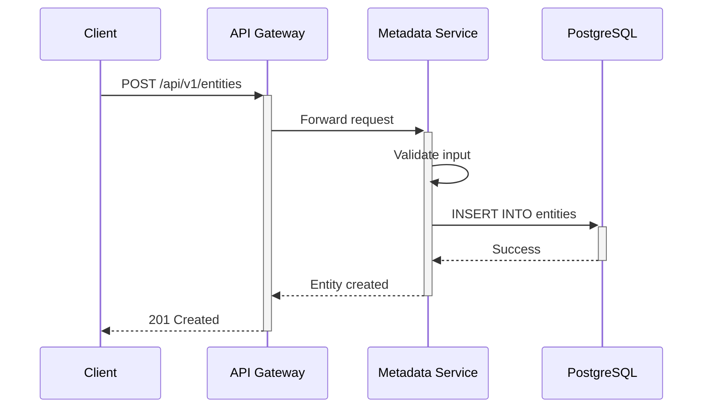
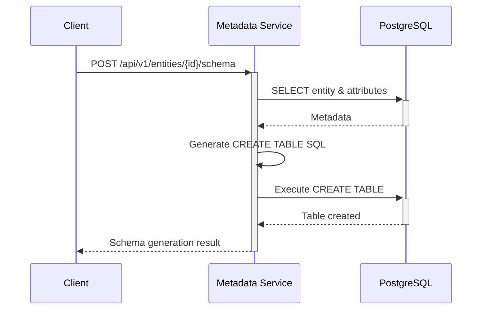
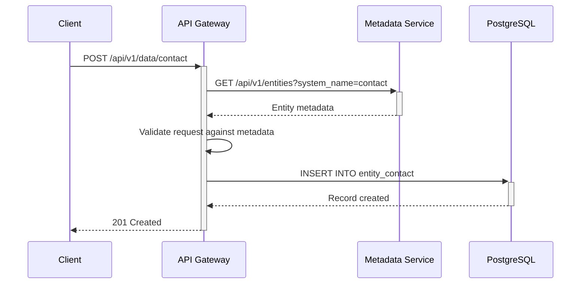

# CoreCRM-R Architecture

## Overview

CoreCRM-R is built on a **metadata-driven**, **microservices architecture** using Rust for maximum performance, reliability, and scalability.

## Core Principles

### 1. Metadata-Driven Design

The entire system is driven by metadata stored in PostgreSQL. This allows:
- Dynamic entity creation without code deployment
- Runtime schema interpretation
- Flexible UI generation
- API auto-generation

**Metadata Flow**:
```
User Input (Entity/Attribute Definition)
    ↓
Metadata Service (Validation & Storage)
    ↓
PostgreSQL Metadata Tables
    ↓
Schema Generator (Creates actual database tables)
    ↓
API Gateway (Auto-generates CRUD endpoints)
    ↓
UI Engine (Dynamically renders forms/grids)
```

### 2. API-First Architecture

Every entity created becomes immediately accessible via API:
- RESTful endpoints (MVP 2)
- GraphQL endpoints (MVP 2)
- Automatic OpenAPI documentation

### 3. Stateless Services

All services are **stateless** to enable:
- Horizontal scaling (add more pods/instances)
- High availability (no single point of failure)
- Easy deployment in Kubernetes/web farms

### 4. Asynchronous Processing

Built on **Tokio** async runtime:
- Non-blocking I/O operations
- Thousands of concurrent connections
- Efficient resource utilization

## System Components

### Metadata Service

**Responsibilities**:
- Manage entity definitions (CRUD)
- Manage attribute definitions (CRUD)
- Validate metadata consistency
- Generate database schemas
- Store metadata in PostgreSQL

**Tech Stack**:
- **Framework**: Axum
- **Database**: PostgreSQL (via SQLx)
- **Port**: 8001

**Key Endpoints**:
- `/api/v1/entities` - Entity management
- `/api/v1/attributes` - Attribute management
- `/api/v1/entities/{id}/schema` - Schema generation

### API Gateway (MVP 2)

**Responsibilities**:
- Route requests to appropriate services
- Auto-generate CRUD endpoints for custom entities
- Handle authentication/authorization
- Rate limiting and throttling
- Request/response transformation

**Tech Stack**:
- **Framework**: Axum
- **GraphQL**: async-graphql
- **Port**: 8000

### Shared Library

**Responsibilities**:
- Common data types (Entity, Attribute, DataType)
- Error handling utilities
- Validation logic

## Data Model

### Core Metadata Tables

#### `entities` Table
Stores entity definitions:
```sql
CREATE TABLE entities (
    id UUID PRIMARY KEY,
    system_name VARCHAR(100) UNIQUE,  -- e.g., "contact", "invoice"
    display_name VARCHAR(255),         -- e.g., "Контакт"
    display_name_plural VARCHAR(255),  -- e.g., "Контакти"
    description TEXT,
    is_system BOOLEAN,                 -- Protected from deletion
    is_active BOOLEAN,
    icon VARCHAR(100),
    created_at TIMESTAMPTZ,
    updated_at TIMESTAMPTZ,
    created_by UUID,
    updated_by UUID
);
```

#### `attributes` Table
Stores attribute (field) definitions:
```sql
CREATE TABLE attributes (
    id UUID PRIMARY KEY,
    entity_id UUID REFERENCES entities(id),
    system_name VARCHAR(100),          -- e.g., "first_name"
    display_name VARCHAR(255),         -- e.g., "Ім'я"
    description TEXT,
    data_type data_type,               -- ENUM: string, integer, lookup, etc.
    is_required BOOLEAN,
    is_unique BOOLEAN,
    is_system BOOLEAN,
    is_active BOOLEAN,
    default_value JSONB,
    lookup_entity_id UUID,             -- For Lookup type
    enum_values JSONB,                 -- For Enum type
    validation_rules JSONB,
    display_order INTEGER,
    created_at TIMESTAMPTZ,
    updated_at TIMESTAMPTZ,
    created_by UUID,
    updated_by UUID,
    UNIQUE (entity_id, system_name)
);
```

#### `data_type` Enum
```sql
CREATE TYPE data_type AS ENUM (
    'string',      -- VARCHAR(255)
    'text',        -- TEXT
    'integer',     -- BIGINT
    'float',       -- DOUBLE PRECISION
    'decimal',     -- NUMERIC(19,4)
    'boolean',     -- BOOLEAN
    'date_time',   -- TIMESTAMPTZ
    'date',        -- DATE
    'lookup',      -- UUID (foreign key)
    'enum'         -- VARCHAR(255)
);
```

### Dynamic Entity Tables

When a user creates an entity with attributes, the system automatically generates:

```sql
CREATE TABLE entity_{system_name} (
    id UUID PRIMARY KEY DEFAULT gen_random_uuid(),
    {attribute_1} {data_type},
    {attribute_2} {data_type},
    ...
    created_at TIMESTAMPTZ NOT NULL DEFAULT NOW(),
    updated_at TIMESTAMPTZ NOT NULL DEFAULT NOW(),
    created_by UUID,
    updated_by UUID
);
```

**Example**: Entity "contact" with attributes "first_name" and "email":
```sql
CREATE TABLE entity_contact (
    id UUID PRIMARY KEY DEFAULT gen_random_uuid(),
    first_name VARCHAR(255) NOT NULL,
    email VARCHAR(255) NOT NULL UNIQUE,
    created_at TIMESTAMPTZ NOT NULL DEFAULT NOW(),
    updated_at TIMESTAMPTZ NOT NULL DEFAULT NOW(),
    created_by UUID,
    updated_by UUID
);
```

## Request Flow

### Creating an Entity



### Generating Schema



### Dynamic CRUD (MVP 2)



## Scalability Strategy

### Horizontal Scaling

**Metadata Service**:
- Run multiple instances behind load balancer
- All instances share same PostgreSQL database
- No session state stored in memory

**API Gateway**:
- Run multiple instances behind load balancer
- Cache metadata for performance (with TTL)
- Stateless request handling

### Vertical Scaling

**Rust Benefits**:
- Compiled to native code (no JVM overhead)
- Efficient memory usage
- Zero-cost abstractions

**Database**:
- PostgreSQL read replicas for read-heavy workloads
- Connection pooling (SQLx)
- Prepared statements for performance

### Caching Strategy (Future)

- **Redis** for metadata caching
- **CDN** for static assets
- In-memory caching with TTL

## Security Considerations

### Authentication (MVP 2)

- JWT-based authentication
- Token validation at API Gateway
- User context propagation to services

### Authorization (MVP 3)

- Role-Based Access Control (RBAC)
- Entity-level permissions
- Field-level security (future)

### Data Security

- All services communicate over HTTPS in production
- Database credentials stored as secrets (Kubernetes secrets)
- SQL injection prevention via SQLx prepared statements
- Input validation at multiple layers

## Performance Optimizations

### Compile-Time Checks

SQLx provides **compile-time SQL verification**:
```rust
sqlx::query!("SELECT * FROM entities WHERE id = $1", id)
```
- SQL syntax validated at compile time
- No runtime SQL parsing overhead
- Type-safe query results

### Database Indexing

Strategic indexes on:
- `entities.system_name` (unique queries)
- `attributes.entity_id` (JOIN operations)
- `attributes.display_order` (sorting)
- Dynamic entity tables: lookups and unique fields

### Connection Pooling

SQLx connection pool:
- Configurable pool size
- Automatic connection reuse
- Idle connection cleanup

## Deployment Architecture

### Development
```
┌─────────────────┐
│   Developer     │
└────────┬────────┘
         │
    ┌────▼────┐
    │  Docker │
    │ Compose │
    └────┬────┘
         │
    ┌────▼──────────────┐
    │  PostgreSQL       │
    │  Metadata Service │
    └───────────────────┘
```

### Production (Kubernetes)
```
┌──────────────────────────────────┐
│        Load Balancer             │
│         (Ingress)                │
└────────────┬─────────────────────┘
             │
    ┌────────▼────────────┐
    │   API Gateway Pods  │
    │   (3+ replicas)     │
    └────────┬────────────┘
             │
    ┌────────▼─────────────────┐
    │ Metadata Service Pods    │
    │   (3+ replicas)          │
    └────────┬─────────────────┘
             │
    ┌────────▼─────────────────┐
    │   PostgreSQL Cluster     │
    │  (Primary + Replicas)    │
    └──────────────────────────┘
```

## Monitoring & Observability

### Logging (Current)
- Structured logging with `tracing`
- JSON log format for production
- Log levels: DEBUG, INFO, WARN, ERROR

### Metrics (Future)
- Prometheus metrics export
- Request latency histograms
- Database query performance
- Error rates by endpoint

### Tracing (Future)
- Distributed tracing with OpenTelemetry
- Request flow visualization
- Performance bottleneck identification

## Technology Decisions

### Why Rust?

| Aspect | Benefit |
|--------|---------|
| **Performance** | Native compilation, zero-cost abstractions |
| **Memory Safety** | No null pointers, no data races |
| **Reliability** | Strong type system catches bugs at compile time |
| **Concurrency** | Fearless concurrency with ownership model |
| **Ecosystem** | Mature async ecosystem (Tokio, Axum, SQLx) |

### Why Axum?

- Built on Tokio and Tower (battle-tested)
- Excellent ergonomics with extractors
- Type-safe routing
- Minimal boilerplate

### Why PostgreSQL?

- JSONB support for flexible metadata storage
- Strong ACID guarantees
- Excellent performance for OLTP workloads
- Rich ecosystem and tooling

### Why SQLx over Diesel?

- True async support (Diesel is sync)
- Compile-time query verification
- Lighter weight
- Better Tokio integration

## Future Enhancements

### MVP 2 Priorities
1. Dynamic CRUD API generation
2. GraphQL support
3. JWT authentication

### MVP 3 Priorities
1. UI metadata (forms, grids)
2. Frontend rendering engine
3. RBAC implementation

### Long-Term Vision
- Business Process Engine (BPMN)
- Real-time collaboration
- Multi-tenancy
- Advanced analytics and reporting
- Mobile SDK

---

**Last Updated**: 2024-01-01
**Version**: MVP 1
